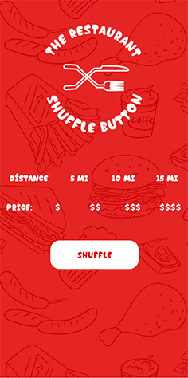

# The Restaurant Shuffle Button

  The Restaurant Shuffle button is a web app to help you decide where to eat with a push of a button

  The live link currently does not work because I do not have an SSL certificate which means I cannot get the users location!

  Live Link: http://restaurant-shuffle-button.herokuapp.com/

## Why Did I Make This?

  When I was in college at the Art Institute of TN - Nashville, I had to do research, design, and prototype an app in my UX Prototyping     class. 
  
  This idea came to me when asking a friend where she wanted to eat and after her saying no to every restaurant nearby, but somehow also     not caring where we go, I said that I wish Google could just pick out a random restaurant to make the decision for her.
  
  Since designing the app I have learned the MERN stack which gave me the ability to make the old project a reality.

## Built Using

- React.js
- React-router-dom
- SCSS
- Node.js
- Express.js
- Axios

## What's it look like?

